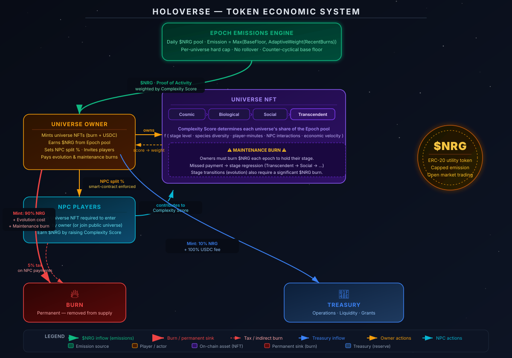

# Holoverse 🌀

**Holoverse** is a next-generation "Entropy-Balanced" universe simulator built on Arbitrum. It is a world where players own, evolve, and sustain unique universes as living, breathing NFT assets.

---

## 🌌 The Vision
In Holoverse, you are the owner and architect of your own universe. Each universe is a unique NFT that progresses through natural stages of development, fueled by **$NRG**. Each NFT provides a unique gaming experience where other players can join and participate in its evolution. A Holoverse NFT is not an asset within a game, it's a whole game.

Unlike static metaverses, Holoverse is governed by a dynamic economic model where maintaining a complex system requires constant input. To see your creation flourish from a cosmic void into a bustling social civilization, you must strategically manage its $NRG resources.

## 🧬 Evolutionary Stages
Each universe evolves through four distinct eras:
1.  **Cosmic:** Shape the laws of physics, forge galaxies, and ignite stars and other celestial bodies.
2.  **Biological:** Witness the emergence of life and guide the emergence of species through actual evolutionary computation.
3.  **Social/Technological:** Incarnate as characters of sentient species. Interact with other players. Build things. Establish commerce and open your world to an unbounded future.
4.  **Transcendent:** Connect universes through quantum interference. Move beyond the limits of the universe to guide the destiny of the Holoverse by joining the _Council_ _of_ _Architects_ to participate in the governance and development of the platform.  

## 💎 The Entropy-Balanced Economy
Holoverse uses a rigorous economic model designed for long-term sustainability:

*   **The Maintenance Burn:** High-level universes require a periodic $NRG burn to maintain their current stage. Failure to provide enough $NRG leads to regression, ensuring $NRG remains a vital utility and preventing the market from being flooded with idle assets.
*   **The NPC Labor Market:** Players who do not own a universe can participate as NPCs in others' worlds. By contributing to a universe's complexity, these players earn a share of the $NRG emitted by Holoverse in a fair, smart-contract-enforced model.
*   **Unified Common Market:** While every universe can develop its own local economy (shops, businesses, and laws), $NRG acts as the global reserve currency, enabling trade and arbitrage across the entire Holoverse.

---

## 🛠️ For Developers
Holoverse is built as a high-performance monorepo:
*   **Blockchain:** Arbitrum (Ethereum L2).
*   **Contracts:** OpenZeppelin-standard ERC-721 (Universes) and ERC-20 ($NRG).
*   **Architecture:** Authoritative off-chain simulation with on-chain ownership and value movement.

**Ready to start?**
*   Read the [Technical Guide](README-TECHNICAL.md)
*   Explore the [Tokenomics v0.2](docs/Holoverse-TOKENOMICS-v0.2.md)
*   Check the [Roadmap](docs/Phase1-plan-v0.2.MD)
